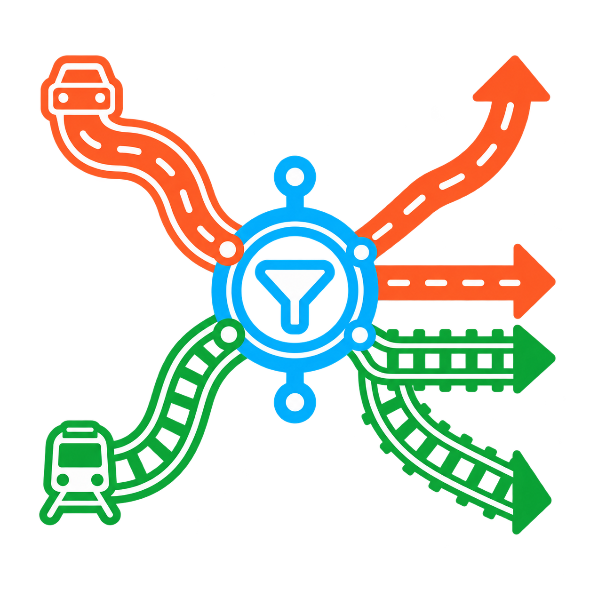

<p align="center">
  <strong>English</strong> · <a href="README.zh-CN.md">简体中文</a>
</p>

<p align="center">
  
</p>

<h1 align="center">RouteFilter</h1>

<p align="center">
  Exact vehicle-asset access control for road and rail networks in <strong>Cities: Skylines II</strong>.
</p>

<p align="center">
  
  
  
</p>

<p align="center">
  <a href="https://mods.paradoxplaza.com/mods/155839/Windows">Paradox Mods</a>
  ·
  <a href="https://forum.paradoxplaza.com/forum/threads/mod-routefilter-per-asset-access-control-for-roads-rails.1938927/">Paradox Forum</a>
  ·
  <a href="https://github.com/Daotie/CS2-RouteFilter/issues">Issues</a>
  ·
  <a href="https://discord.gg/Y9UXFCkqmD">Discord</a>
</p>

---

RouteFilter lets you decide which exact vehicle assets may pass through one network node or an entire road, tram, train, or subway segment.

A matching vehicle is stopped before crossing the restricted target and is asked to find another route when the network provides one.

## Highlights

- Restrict individual vehicle assets instead of broad traffic categories.
- Apply independent forbidden lists to specific nodes or complete network segments.
- Support road vehicles, outside traffic, trams, trains, subway vehicles, engines, carriages, and recognized trailers.
- Discover available base-game, content-pack, and custom vehicle prefabs automatically.
- Filter the catalog to assets compatible with the selected road or rail target.
- Search, paginate, and scroll the asset catalog without hiding the application controls.
- Inspect an asset's maximum speed in km/h, acceleration, and braking on hover.
- Group recognized engines or tractors with their carriages and trailers while retaining individual control.
- Show clear node circles and segment outlines before selection, with a distinct selected-target highlight.
- Load the saved forbidden list belonging to the selected target; pending changes never silently affect the whole map.
- Request a detour through the game's pathfinding data and prevent a matching vehicle from simply driving through when no alternative exists.
- Store restrictions in the savegame and follow the game's English or Simplified Chinese language automatically.

## In-game overview

### 1. Select a precise network target

Choose **Node** or **Segment**, then left-click the highlighted target. Right-click cancels the selection.

<!-- Screenshot placeholder: assets/screenshots/01-target-selection.png -->
<!--  -->

### 2. Choose exact vehicle assets

Selected entries are the assets that will be **forbidden**.

Road targets show road vehicles; rail targets show compatible rail assets. Hover an entry to inspect its base parameters. Expanding a recognized consist enables separate engine, carriage, or trailer choices.

<!-- Screenshot placeholder: assets/screenshots/02-asset-catalog.png -->
<!--  -->

### 3. Review and apply

**Forbid all assets** and **Allow all assets** only edit the pending list. Nothing is written to the map until **Apply list to selected target** is pressed.

Selecting another target loads that target's own saved list. **Clear target restrictions** removes RouteFilter data from the selected target.

<!-- Screenshot placeholder: assets/screenshots/03-apply-restriction.png -->
<!--  -->

### 4. Vehicle enforcement and rerouting

RouteFilter checks current lanes, upcoming navigation lanes, path elements, node endpoints, and every recognized prefab in a vehicle consist.

For a matching vehicle, it briefly marks the target unavailable to the pathfinder and invalidates that vehicle's current path. If a valid alternative exists, the vehicle can reroute; otherwise it is prevented from continuing normally through the restricted target and may retry.

<!-- Screenshot placeholder: assets/screenshots/04-rerouting-result.png -->
<!--  -->

## Installation

### Paradox Mods

Subscribe to **RouteFilter** on [Paradox Mods](https://mods.paradoxplaza.com/mods/155839/Windows) and add it to the active playset.

Restart the game if the playset requests it.

### Manual installation

1. Download the latest archive from [GitHub Releases](https://github.com/Daotie/CS2-RouteFilter/releases).
2. Extract it into the local Cities: Skylines II mods directory.
3. Enable **RouteFilter** in the active playset.
4. Restart the game before replacing an older DLL.

> [!IMPORTANT]
> Back up important cities before changing any code-mod setup.

## Quick start

1. Click the RouteFilter button in the top-left toolbar, or press `Ctrl+Shift+N`.
2. Choose **Node** or **Segment**.
3. Left-click the network target to edit.
4. Select the vehicle assets that should be forbidden.
5. Press **Apply list to selected target**.
6. Re-select the target at any time to review or change its saved list.

The shortcut is remappable in the game's settings. Closing the panel also closes the selection tool.

## Configuration

| Setting | Default | Purpose |
| --- | --- | --- |
| Asset-level restrictions | On | Enables exact prefab matching at restricted nodes and segments. |
| Emergency vehicle protection | Off | Allows police cars, ambulances, and fire engines even if their assets are selected. |
| Look-ahead lanes | 3 | Controls how early an approaching vehicle checks for a restriction. |
| Show/hide panel | `Ctrl+Shift+N` | Opens or closes both the RouteFilter panel and selection tool. |

## Save data and upgrades

RouteFilter `1.0.3` stores each restricted target's forbidden asset list in the save's versioned payload using stable prefab names and re-applies it after loading.

Saves from `1.0.1` and earlier remain readable; their per-entity restriction data is preserved.

Rebuilding, replacing, or deleting a road or track segment creates new game entities and may remove restrictions attached to the original target. Review restrictions after substantial network reconstruction.

## Important behavior and limitations

- Asset names are technical prefab names supplied by the game or asset author; a localized display name may not exist.
- Engine/carriage grouping appears only where the game exposes a fixed-trailer or multiple-unit relationship.
- A fixed public-transport route cannot always be changed into a valid detour. When no alternative exists, the affected vehicle is stopped and may retry; RouteFilter does not redraw the player's transport line.
- During the short pathfinding barrier window, another vehicle requesting a route may also avoid the selected target.
- Compatibility with mods that replace vehicle navigation, pathfinding, or network entities cannot be guaranteed. Report conflicts with a minimal playset and logs.

## Community

Join the RouteFilter community to ask questions, share how you use the mod, follow development, participate in testing, and discuss new ideas.

- **[Discord](https://discord.gg/Y9UXFCkqmD)** — General chat, support, showcases, suggestions, and testing.
- **[Paradox Forum](https://forum.paradoxplaza.com/forum/threads/mod-routefilter-per-asset-access-control-for-roads-rails.1938927/)** — Long-form discussion and community support.
- **[GitHub Issues](https://github.com/Daotie/CS2-RouteFilter/issues)** — Formal bug reports, performance issues, compatibility reports, and feature tracking.
- **[Paradox Mods](https://mods.paradoxplaza.com/mods/155839/Windows)** — Official download and updates.

**English and Chinese are both welcome.**

### Which channel should I use?

| Channel | Best for |
| --- | --- |
| Discord | Quick questions, general discussion, community support, showcases, suggestions, and testing feedback |
| Paradox Forum | Long-form discussion, general feedback, and community support |
| GitHub Issues | Reproducible bugs, performance problems, compatibility issues, and feature requests that need formal tracking |
| Paradox Mods | Installing, subscribing to, and updating RouteFilter |

## Compatibility and support

RouteFilter uses the official Cities: Skylines II code-mod toolchain and does not require a separate framework mod.

For problems, first reproduce the issue with the latest RouteFilter release and the smallest practical playset.

When reporting a technical problem, please include when applicable:

- Game version
- RouteFilter version
- Description of the problem
- Expected behavior
- Reproduction steps
- Active traffic or network mods
- `Player.log`
- Playset information
- Relevant screenshots or videos

General questions and informal feedback are welcome on Discord or the Paradox Forum.

For reproducible bugs, performance issues, compatibility problems, and feature requests that need to be tracked, please use [GitHub Issues](https://github.com/Daotie/CS2-RouteFilter/issues) whenever possible.

### Project documentation

- Help and bug reporting: [SUPPORT.md](SUPPORT.md)
- Security disclosures: [SECURITY.md](SECURITY.md)
- Release history: [CHANGELOG.md](CHANGELOG.md)
- Contribution guide: [CONTRIBUTING.md](CONTRIBUTING.md)

## Development

RouteFilter is open source and contributions are welcome.

### Requirements

- Cities: Skylines II with the official modding toolchain
- .NET SDK
- Node.js 18 or later

### Build

```powershell
dotnet build RouteFilter.csproj -c Release

cd UI
npm ci

$env:ROUTEFILTER_OUTPUT_DIR = (Join-Path (Get-Location) "build")
npm run build
npm audit --omit=dev
```

The official Paradox Mods metadata and publish profiles are stored under `Properties`.

See [RELEASING.md](RELEASING.md) for the complete release checklist.

## License and copyright

Copyright © 2026 Daotie. All copyright in the original RouteFilter source code and other original project materials remains with their respective copyright holders.

RouteFilter is free and open-source software licensed under the [GNU General Public License version 3 only](LICENSE) (`GPL-3.0-only`).

You may use, study, modify, and redistribute RouteFilter under the terms of the GNU General Public License version 3. If you modify and redistribute covered material, you must comply with the applicable GPL-3.0 requirements, including the corresponding source code and licensing requirements.

The complete license terms are available in the repository's [LICENSE](LICENSE) file.

Unless explicitly stated otherwise, original source code provided by the RouteFilter project is licensed under `GPL-3.0-only`.

Third-party libraries, dependencies, assets, game resources, trademarks, and other third-party materials are not relicensed by RouteFilter. They remain subject to their respective licenses, terms, copyright, and other intellectual-property rights.

Contributions submitted to this repository are understood to be provided under the project's applicable `GPL-3.0-only` license unless otherwise explicitly agreed or stated.

## Trademarks and project affiliation

Cities: Skylines II, Colossal Order, Paradox Interactive, and related names, logos, trademarks, game assets, and other intellectual property belong to their respective owners.

RouteFilter is an independent community-developed open-source project by Daotie.

RouteFilter is not affiliated with, sponsored by, authorized by, endorsed by, or otherwise officially associated with Colossal Order or Paradox Interactive.

References to Cities: Skylines II and related products are used solely to identify compatibility and the intended game environment.
